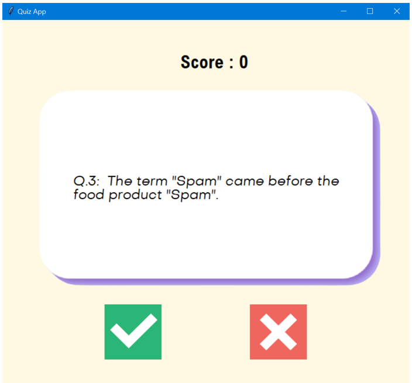
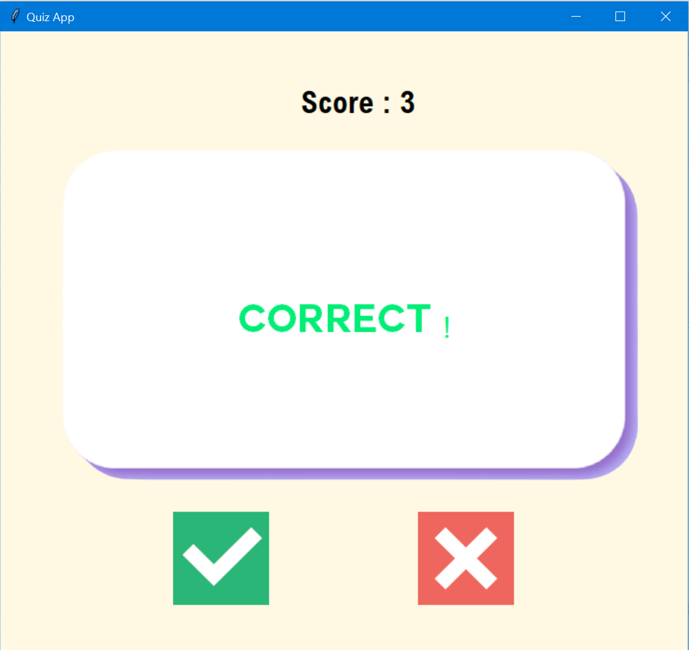
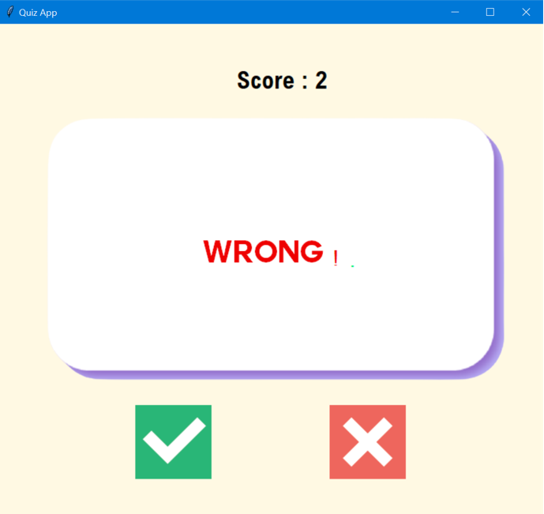

# Quiz-App
bunnysaini/Quiz-App

## Features
A quiz app that offers you 10 randomly generated questions from [Open Trivia Database API](https://opentdb.com/) and test your skills, comes along with Tkinter GUI.

## Instructions to Use
- This program generates 10 random True / False Questions
- Guess True or False and click the buttons
- At the end recieve your final score out of 10

## Result
Question

Correct / Incorrect Message

 
